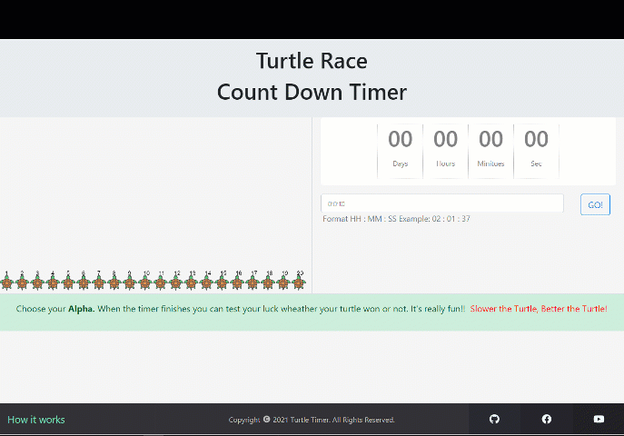

# Turtle Race CountDown Timer

Boost your productivity with **pomodoro technique** and **Turtle race countdown timer.** Built with react.js

## Description

Turtle race countdown timer is a simple countdown timer. But the interesting thing is that in any traditional countdown timer you do not get any reward when the timer finishes. But in the Turtle race countdown timer you can choose your **ALPHA** turtle in your mind before starting the timer. After the race finishes you can see how your turtle did and check your luck. It kept me using the **pomodoro technique** more and more as well as the **timer.** It's really fun because **SLOWER THE TURTLE, BETTER THE TURTLE**

As the velocity constantly changing, you never know who wins!

        

## Installation

-   Clone the repo in your terminal by clicking the _green_ clone or download button at the top right and copyin the url
-   In your terminal, type `git clone URL`
    -   replace URL with the url you copied
    -   hit enter
-   This will copy all the files from this repo down to your computer
-   In your terminal, cd into the directory you just created
-   Type `npm install` to install all dependencies
-   Last, but not least, type `npm start` to run the app locally.

-   To look at the code, just open up the project in your favorite code editor!

## Try a race now

Plese **[visit here](https://sudiptobaral.com/turtle-timer/)** to try the timer. Thank you.
